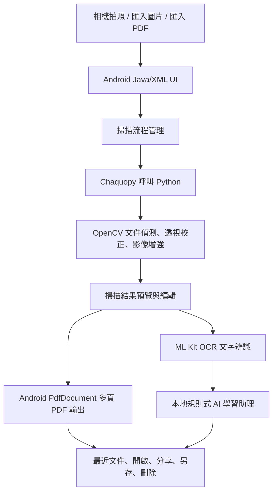
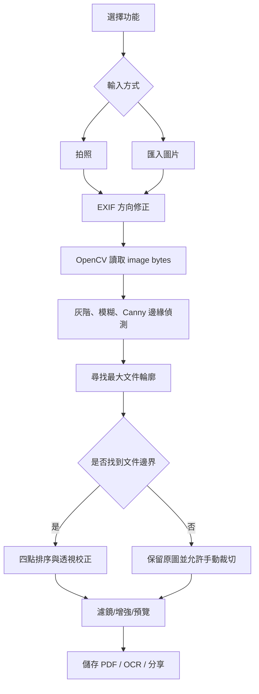

# ScanMate

ScanMate 是一個 Android 期末專題 App，目標是把手機變成可攜式文件掃描與學習整理工具。系統支援拍照或匯入圖片，透過 Python OpenCV 進行文件偵測、透視校正與影像增強，再使用 Android PDF 工具完成多頁 PDF 建立、管理、開啟與分享；另外整合 ML Kit OCR 與本地規則式 AI 學習助理，協助學生整理掃描內容。

## 1. 專題故事與應用情境

學生在課堂、實驗室或考前整理資料時，常會遇到紙本講義、手寫筆記、實驗紀錄、考卷與作業分散保存的問題。ScanMate 的應用情境是「學生的隨身掃描與學習整理工具」：使用者可以用手機拍攝文件、裁切校正、輸出 PDF、執行 OCR，並把文字送到 AI 學習助理產生文件類型建議、重點、關鍵字與複習題。

主要使用者為學生、一般文件整理者與需要快速數位化紙本資料的人。系統完成後可降低整理紙本資料的時間，讓掃描、PDF 管理、文字擷取與學習整理集中在同一個 App 中完成。

## 2. 系統需求與目標規格

| 項目 | 規格 |
| --- | --- |
| 輸入來源 | Android 相機拍照、手機圖片檔、多頁圖片、PDF 檔 |
| 輸出結果 | App 預覽、掃描後影像、OCR 文字、PDF、TXT、圖片、最近文件紀錄 |
| 即時性需求 | 本專題以靜態文件掃描為主，不做連續影像即時辨識；拍照後進行處理與預覽 |
| 影像處理 | OpenCV 文件邊緣偵測、輪廓定位、透視校正、濾鏡增強 |
| PDF 規格 | 1 張圖片輸出 1 頁 PDF，N 張圖片輸出 N 頁 PDF |
| 成功條件 | 可完成拍照/匯入、裁切、編輯、PDF 儲存/開啟/分享、OCR、AI 學習助理與最近文件流程 |

## 3. 實作技術與工具

| 技術 | 版本/環境 | 在系統中的角色 |
| --- | --- | --- |
| Android Java/XML | minSdk 24, targetSdk 36, compileSdk 36 | 建立 App UI、Activity 流程、Intent 分享與文件管理 |
| Android Gradle Plugin | 9.2.1 | Android 專案建置 |
| Chaquopy | 17.0.0 | 讓 Android Java 呼叫 Python 影像處理 |
| Python | 3.10 | 執行 OpenCV 文件掃描演算法 |
| OpenCV Python | pip package | 文件輪廓偵測、透視校正、影像增強 |
| numpy | pip package | OpenCV 影像矩陣處理 |
| ML Kit Text Recognition | 16.0.1 | OCR 文字辨識 |
| Android PdfDocument / PdfRenderer | Android Framework | PDF 建立、預覽、頁面處理 |

選擇 Chaquopy 與 OpenCV 的原因是 Python OpenCV 在文件掃描演算法開發上較快速，並可保留 Android 原生 UI 與 PDF 管理能力。AI 學習助理目前不是雲端 AI 或大型語言模型，而是使用 OCR 文字搭配本地規則式分析，適合期末展示與離線執行。

## 4. 系統架構圖



## 5. 演算法與程式流程



## 6. 資料集設計與測試方法

本專題沒有訓練大型 AI 模型，因此沒有訓練集/驗證集切分。測試資料採用自行拍攝與匯入的文件圖片，包含課堂筆記、鍵盤旁文件、手寫紙張、PDF 文件與多張圖片組合。測試條件涵蓋直向與橫向拍攝、不同光線、不同裁切框位置、單頁與多頁 PDF。

測試方式以功能流程驗證為主：

| 類別 | 測試方法 |
| --- | --- |
| 掃描 | 拍照、匯入圖片、裁切、旋轉、濾鏡、完成 |
| PDF | 單頁 PDF、多頁 PDF、開啟、分享、另存、刪除 |
| OCR | 拍照 OCR、選圖 OCR、空結果提示、匯出 TXT |
| AI 學習助理 | OCR 文字傳入、手動貼上文字、文件類型判斷、命名建議 |
| 文件管理 | 最近文件、搜尋、查看、分享、刪除 |

## 7. 效能、正確率與規格比較

目前展示版本已完成建置與實機基本測試。因系統為靜態文件掃描，不以連續 FPS 作為主要指標。

| 項目 | 實測/狀態 |
| --- | --- |
| 硬體平台 | Android 手機實機測試，ADB device: R5CX12EEYDB |
| 影像解析度 | 依手機拍照或匯入圖片解析度而定 |
| FPS | 不適用，非連續影像串流辨識 |
| Latency | 拍照後進入裁切/預覽流程，處理時間受圖片大小與手機效能影響 |
| Build | `./gradlew.bat assembleDebug` 通過 |
| App 啟動 | MainActivity 可正常啟動，首頁 8 個功能入口可顯示 |
| OCR/AI | OCR 可將結果送到本地規則式 AI 學習助理 |

更完整的量測表請見 [docs/test_results.md](docs/test_results.md)。

## 8. 問題、除錯過程與解法

| 問題 | 原因分析 | 最後解法 | 改善結果 |
| --- | --- | --- | --- |
| Android 與 Python OpenCV 整合 | Android Java 不能直接執行 Python OpenCV | 使用 Chaquopy，Java 傳入 image bytes，Python 回傳 PNG bytes | 保留 Android UI，也能使用 OpenCV 演算法 |
| 多張圖片轉 PDF | 每張圖片需要獨立頁面尺寸處理 | 使用 Android PdfDocument 逐頁建立 | 達成 1 張 1 頁、N 張 N 頁 |
| 拍照方向錯誤 | 相機圖片含 EXIF 方向資訊 | 在 OCR 與工具拍照流程加入 EXIF 方向修正 | 減少橫向/倒轉預覽問題 |
| 功能入口閃退風險 | 部分功能尚未完整實作 | 未完成項目顯示後續擴充提示 | 展示時不因 placeholder 崩潰 |
| AI 助理不可依賴雲端 | 期末展示需穩定、離線、避免 API 金鑰 | 採用 OCR 文字與本地規則式分析 | 可展示 AI 學習概念且不依賴網路 |

## 9. Demo 影片與現場展示

建議 Demo 影片長度約 1 分鐘，內容順序：

1. 開啟 ScanMate 首頁。
2. 使用智慧掃描拍照或匯入圖片。
3. 裁切、套用濾鏡並完成。
4. 儲存 PDF，展示最近文件、開啟與分享。
5. 使用 OCR 擷取文字。
6. 將 OCR 結果送到 AI 學習助理，展示文件類型、命名建議、重點與複習題。

Demo 影片連結：待上傳後填入。

## 10. GitHub 版控與執行方式

本 Repository 保留開發 commit 紀錄，包含掃描流程、PDF 工具、OCR、AI 學習助理與展示穩定化版本。

### 安裝方式

1. 安裝 Android Studio。
2. Clone 本專案。
3. 使用 Android Studio 開啟專案根目錄。
4. 確認 JDK 使用 Android Studio 內建 JBR。
5. 同步 Gradle。

### 建置方式

```powershell
$env:JAVA_HOME='C:\Program Files\Android\Android Studio\jbr'
$env:Path="$env:JAVA_HOME\bin;$env:Path"
.\gradlew.bat assembleDebug
```

APK 輸出位置：

```text
app/build/outputs/apk/debug/app-debug.apk
```

### 執行方式

1. 連接 Android 手機並開啟 USB debugging。
2. 使用 Android Studio Run 或安裝 debug APK。
3. 從首頁進入掃描、PDF 工具、OCR、AI 學習助理或文件管理流程。

## 11. 系統限制與未來改進

目前限制：

- 文件邊界偵測會受光線不足、背景複雜、文件與背景顏色相近影響。
- 本版本以靜態圖片處理為主，沒有做 CameraX 即時框線偵測。
- AI 學習助理是本地規則式分析，不是大型語言模型，因此摘要與問答深度有限。
- OCR 正確率受字跡、模糊、角度與影像解析度影響。
- PDF 轉 Word/Excel/PPT 等進階功能目前以展示與基礎輸出為主，後續可再完整強化。

未來改進：

- 加入更穩定的即時文件邊界提示。
- 建立正式測試資料集與 OCR/掃描準確率量測。
- 擴充 AI 摘要與問答，可選擇性串接雲端或本地語言模型。
- 加入 Room 或雲端同步保存最近文件。
- 優化 PDF 壓縮品質與處理速度。

## 12. 分工與貢獻說明

| 成員 | 貢獻 |
| --- | --- |
| 林秉宏 | Android Java/XML 介面、掃描流程、Chaquopy/OpenCV 整合、PDF 工具、OCR、AI 學習助理、測試與展示整理 |

若為多人組別，可在此表補上每位組員的實際負責項目，並搭配 GitHub commit 紀錄作為佐證。

## 目前完成的主要功能

- 智慧掃描：拍照、匯入圖片、裁切、旋轉、濾鏡與完成流程。
- PDF 工具：建立、開啟、分享、另存、合併、分割、刪頁、重排、旋轉、壓縮、轉圖片、轉長圖。
- OCR：拍照/選圖文字辨識、結果顯示、匯出 TXT、送到 AI 學習助理。
- AI 學習助理：文件類型判斷、自動命名建議、重點整理、關鍵字、複習題。
- 文件管理：最近文件、搜尋、查看、分享、另存、刪除。
- 展示穩定化：未完成入口顯示擴充提示，避免展示時閃退。
